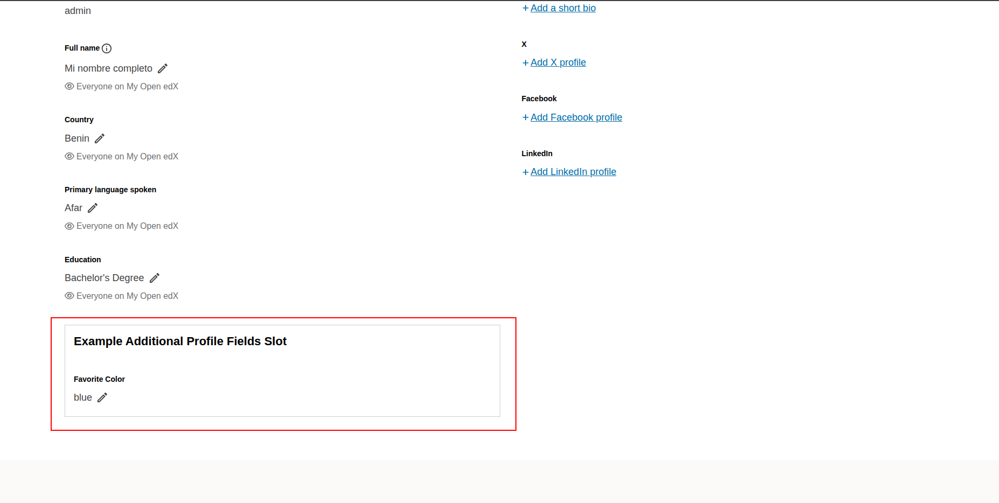

# Additional Profile Fields

### Slot ID: `org.openedx.frontend.slot.profile.additionalProfileFields.v1`

### Slot Props

* `updateUserProfile`
* `profileFieldValues`
* `profileFieldErrors`
* `formComponents`
* `refreshUserProfile`

## Description

This slot is used to replace, modify or hide the additional profile fields on the profile page. It
renders nothing by default.

## Example

The following `site.config` extends the default fields with a custom one through the example
component in [`./example`](./example/index.jsx), which stores a favorite color in the user's
extended profile. The import path below is this repository's; the package exports only the app, so a
site copies the component into its own source tree and imports it from there.



```jsx
import { WidgetOperationTypes } from '@openedx/frontend-base';
import Example from './src/slots/AdditionalProfileFieldsSlot/example';

const siteConfig = {
  // ...
  slots: [
    {
      slotId: 'org.openedx.frontend.slot.profile.additionalProfileFields.v1',
      id: 'additional_profile_fields',
      op: WidgetOperationTypes.APPEND,
      component: Example,
    },
  ],
};

export default siteConfig;
```

## Slot Props

Widgets rendered with `component` receive the following props. They are also available through
`useSlotContext()` from `@openedx/frontend-base`.

### `updateUserProfile`
- **Type**: Function
- **Description**: A function for updating the user's profile with new field values. This handles the API call to persist changes to the backend and updates the page with the values the server returns.
- **Usage**: Pass the username and an object containing the field updates to be saved to the user's profile. It returns a promise that resolves to the updated account, or rejects with the API error.

#### Example
```javascript
updateUserProfile(username, { extendedProfile: [{ fieldName: 'favorite_color', fieldValue: value }] });
```

### `profileFieldValues`
- **Type**: Array of Objects
- **Description**: Contains the current values of all additional profile fields as an array of objects. Each object has a `fieldName` property (string) and a `fieldValue` property (which can be string, boolean, number, or other data types depending on the field type).
- **Usage**: Access specific field values by finding the object with the matching `fieldName` and reading its `fieldValue` property. Use array methods like `find()` to locate specific fields.

#### Example
```javascript
// Finding a specific field value
const nifField = profileFieldValues.find(field => field.fieldName === 'nif');
const nifValue = nifField ? nifField.fieldValue : null;

// Example data structure:
[
    {
        "fieldName": "favorite_color",
        "fieldValue": "red"
    },
    {
        "fieldName": "employment_situation",
        "fieldValue": "Unemployed"
    },
]
```

### `profileFieldErrors`
- **Type**: Object
- **Description**: Contains validation errors for profile fields. Each key corresponds to a field name, and the value is the error message.
- **Usage**: Check for field-specific errors to display validation feedback to users.

### `formComponents`
- **Type**: Object
- **Description**: Provides access to reusable form components that are consistent with the rest of the profile page styling and behavior. These components follow the platform's design system and include proper validation and accessibility features.
- **Usage**: Use these components in your custom fields implementation to maintain UI consistency. Available components include `SwitchContent` for managing different UI states, `EmptyContent` for empty states, and `EditableItemHeader` for consistent headers.

### `refreshUserProfile`
- **Type**: Function
- **Description**: A function that triggers a refresh of the user's profile data. This can be used after updating profile fields to ensure the UI reflects the latest data from the server.
- **Usage**: Call this function with the username parameter when you need to reload the user profile information from the server, for instance after saving through some other means. `updateUserProfile` already refreshes the page with the values it saves.

#### Example
```javascript
refreshUserProfile(username);
```
